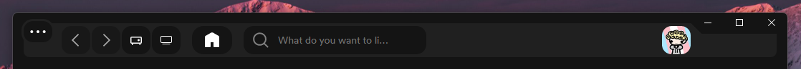
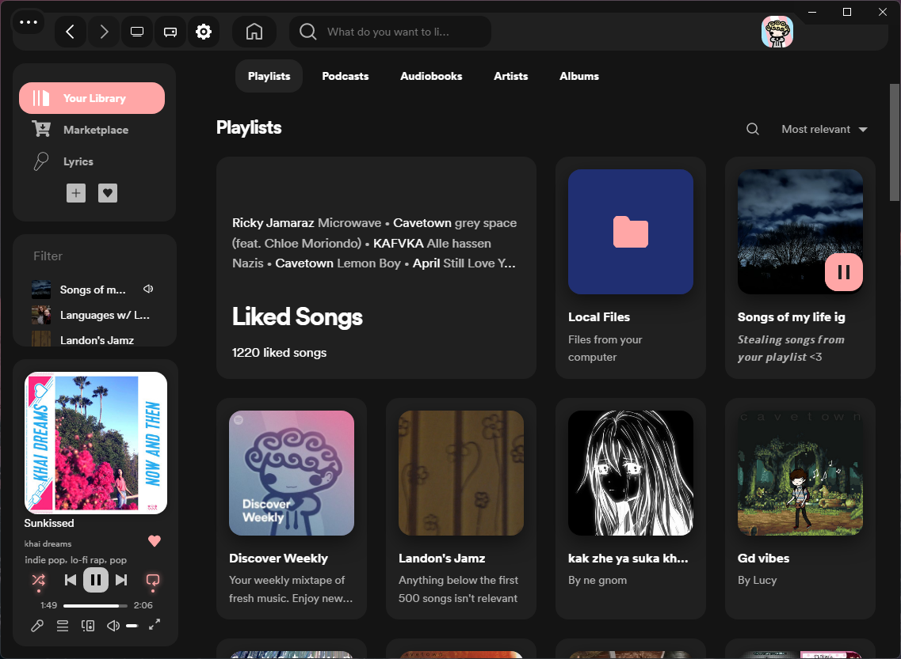
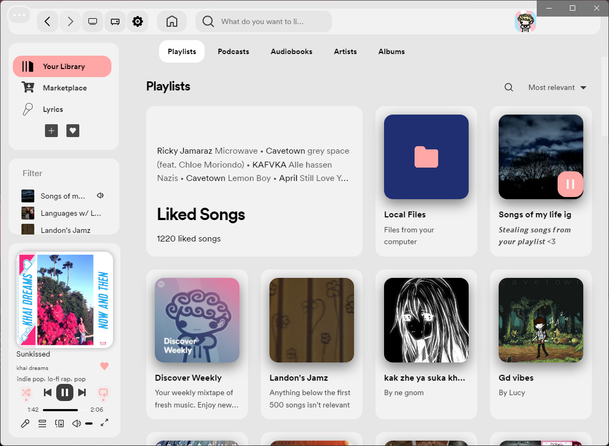
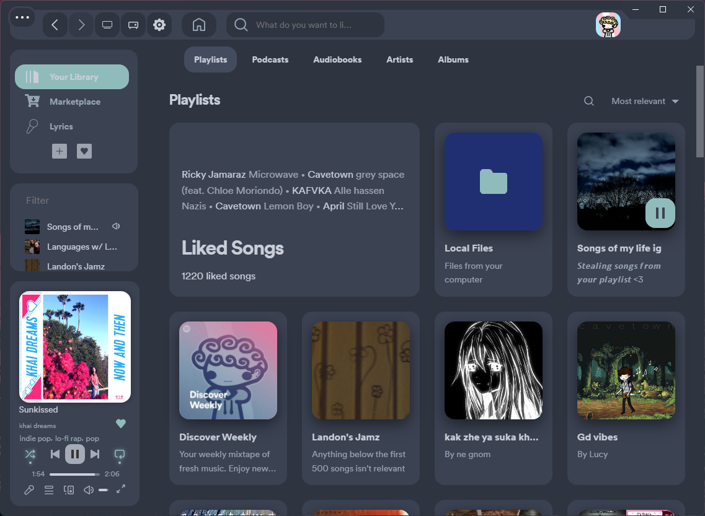
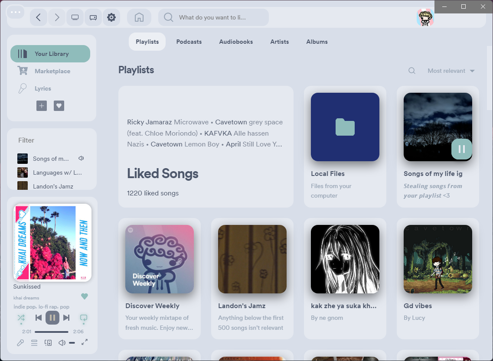
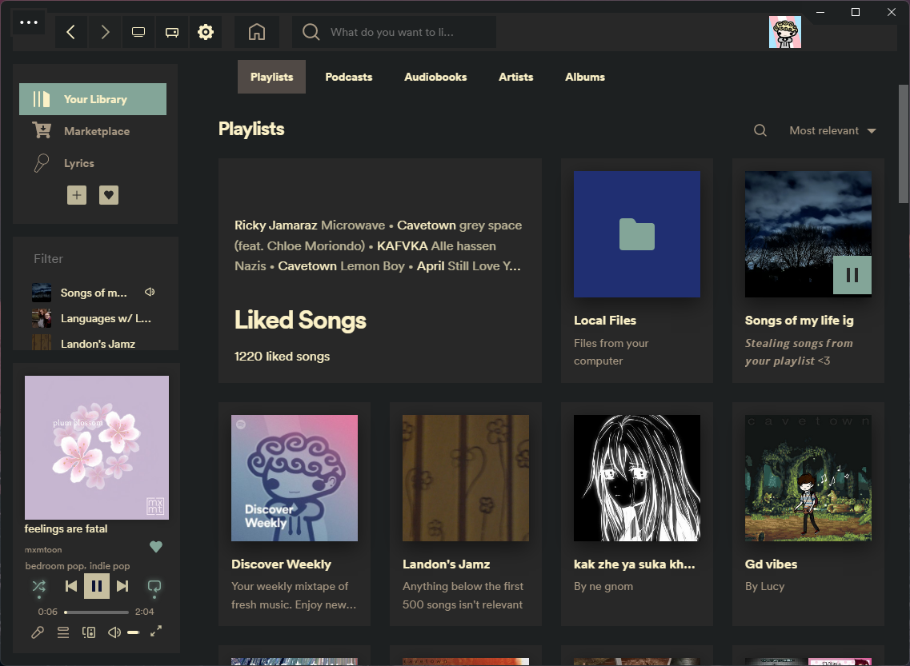
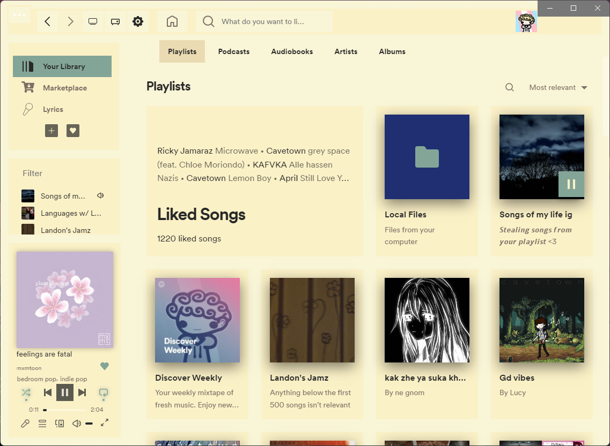
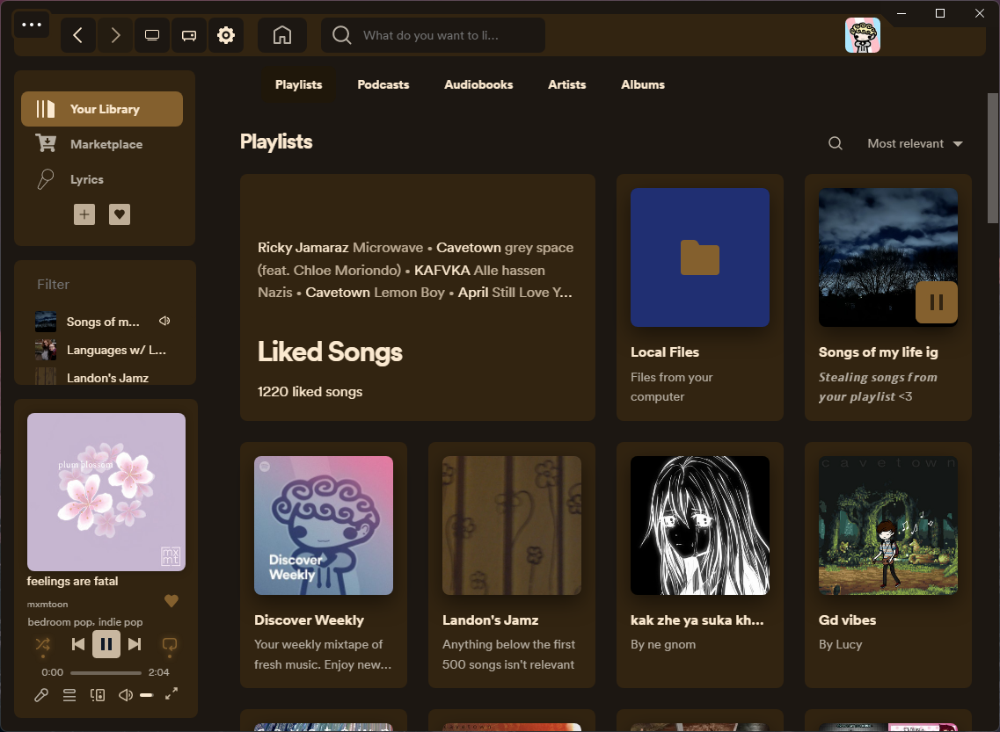

## Table of Contents
- [Todo](#todo)
  - [JavaScript](#javascript)
  - [CSS](#css)
- [Applying](#applying)
  - [Linux/Mac](#LinuxMac)
  - [Windows](#windows)

# Pocket-Spotify
A Segmented theme for Spicetify <3





## Applying
### Available on the marketplace
##### <a name="LinuxMac"></a>Linux/Mac
```bash
curl -fsSL "https://raw.githubusercontent.com/LucyUwi/Pocket/main/install.sh" | sh
```
##### Windows
```powershell
Invoke-WebRequest -UseBasicParsing "https://raw.githubusercontent.com/LucyUwi/Pocket/main/install.ps1" | Invoke-Expression
```

## Preset Previews
|            **Dark**           |            **Light**           |
|:-----------------------------:|:------------------------------:|
|         |         |
|         **Nord Dark**         |         **Nord Light**         |
|     |     |
|        **Gruvbox Dark**       |        **Gruvbox Light**       |
|  |  |
|        **Dirty Coffee**       |                                |
|  |                                |


## Todo
###### JavaScript
- [x] Rewrite JS
  - [x] Add Comments 
  - [x] Create a class with all the functions
  - [x] Clean up the code

###### CSS
- [ ] Rewrite the CSS
  - [ ] Add Comments
  - [ ] Clean up the code
    - [ ] Group Classes
